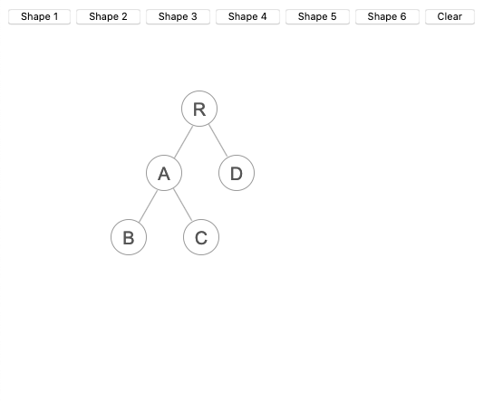

# React VDom Diff Demo

打开浏览器观察虚拟DOM的生命周期



灵感来自于 https://github.com/supnate/react-dom-diff


依赖

```json
    "react": "^17.0.1",
    "react-dom": "^17.0.1",
```

## build

NODE_ENV = 'production' yarn run build

## docs

build &&  mv build docs

